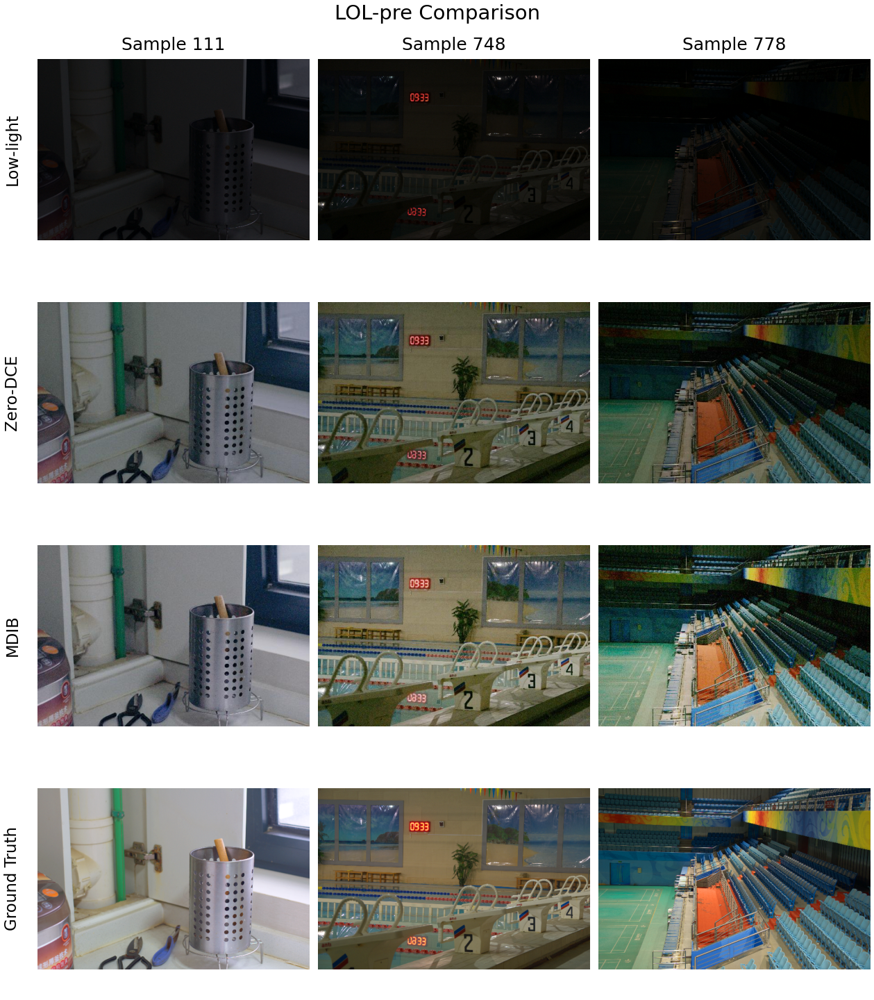

# Low Light Image Enhancement

Utilities for running the MDIB and Zero-DCE low-light enhancement models and
comparing their outputs on the LOL-pre evaluation set.



## Requirements

Install the dependencies into your Python environment:

```bash
pip install -r requirements.txt
```

Key packages: NumPy, Pillow, PyTorch (with torchvision), matplotlib,
scikit-image, and pyiqa.

## Run the Enhancement Models

Each method writes its enhanced outputs under its own `data/result` folder.

```bash
# MDIB
python3 MDIB/MDIB_Code/lowlight_test.py

# Zero-DCE
python3 Zero-DCE/Zero-DCE_code/lowlight_test.py
```

Ensure the `data/test_data` folders contain the LOL-pre low-light inputs, and
the `snapshots/Epoch99.pth` weights exist for each model.

## Generate Comparison Artifacts

After both enhancement runs finish, create the plots and metrics:

```bash
cd Comparison
python3 compare_mean.py         # aggregate quality metrics & plots
python3 compare_per_image.py    # per-image metric breakdown
python3 compare_psnr_ssim.py    # PSNR/SSIM summary + bar charts
python3 compare_images.py       # side-by-side collage in results_images/
```

The outputs are written into `Comparison/results_mean`, `Comparison/results_per_image`,
and `Comparison/results_images`. PSNR/SSIM values are computed only for the
LOL-pre dataset, matching the project requirements.
